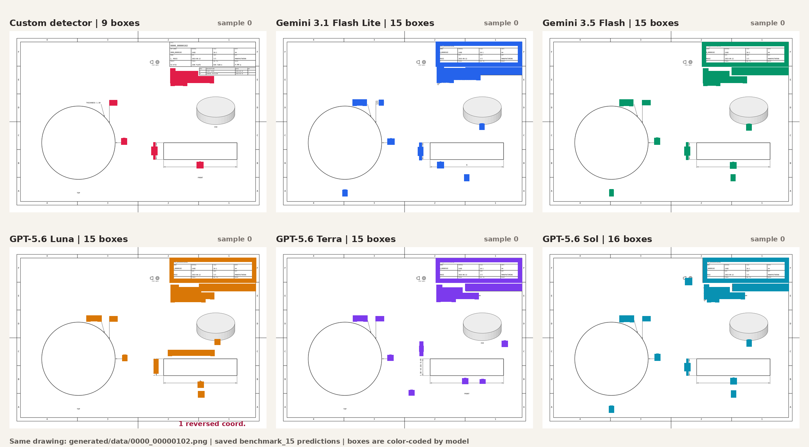

# Benchmarks — models and metrics

The `benchmarks` package evaluates models on drawing and table datasets. It
loads datasets and models through small interfaces, runs model inference,
saves structured outputs, and computes configured metrics from those outputs
and the dataset ground truth.

Run the benchmark scripts from `benchmarks/`. They import `datasets.*`,
`models.*`, and `metrics.*` as local modules and write to the local `results/`
directory.

```text
YAML configuration -> datasets + models -> benchmark.py -> model outputs
                                      -> compute_metrics.py -> metric outputs
```

## Contents

1. Running benchmarks
2. Configuration
3. Results and output layout
4. Dataset interface
5. Model interface
6. Metrics
7. Available components
8. Extending the framework
9. Tests and limitations
10. Related components

## 1. Running benchmarks

Install the repository dependencies first. From this directory:

```bash
python benchmark.py
python benchmark.py --config path/to/config.yml
python benchmark.py --test
python benchmark.py --no_costs
```

`benchmark.py` creates a uniquely named directory under `results/`, loads each
configured dataset and model, runs every model on every selected sample, and
then calls metric computation. `--test` walks through the configured loops
without model inference or output-dependent metric aggregation. The
`--no_costs` option avoids querying OpenRouter usage; it cannot be used when
`cost` is included in the configured metrics.

Compute metrics independently when model output files already exist:

```bash
python compute_metrics.py --name benchmark_name
python compute_metrics.py --name benchmark_name --config path/to/config.yml
```

Here `--name` must be the actual directory name under `results/`. The script
requires the configured output files for every selected sample and model.

## 2. Configuration

The default configuration file is `default.yml`. Supported keys are:

| key | meaning |
|---|---|
| `name` | Name for the result directory; defaults to `benchmark`. |
| `datasets` | Dataset module names, imported from `datasets.<name>`. |
| `models` | Model module names, imported from `models.<name>`. |
| `metrics` | Metric module names, imported from `metrics.<name>`. |
| `samples_cap` | Optional per-dataset sample limit; omitted or negative means no limit. |

Dataset modules must expose `DatasetClass`, model modules must expose
`ModelClass`, and metric modules must expose `Metric`. The current checked-in
`default.yml` requests the `generated` dataset, the `custom`, Gemini, and
OpenAI model modules configured there, eight metrics, and a sample cap of 25.
The small `test_custom.yml` is another configuration for local testing.

Example:

```yaml
name: "benchmark"
samples_cap: 10
datasets:
- generated
- custom_test
models:
- custom
- gemini_3_1_flash_lite
metrics:
- bbox_f1
- bbox_precision
- bbox_recall
```

When `results/<name>/` already exists, `benchmark.py` chooses
`<name>_v2`, `<name>_v3`, and the next unused suffix. It does not overwrite an
existing run.

The `.env` file is used for environment variables such as
`OPENROUTER_API_KEY`. OpenRouter-backed models require the relevant key when
inference or cost estimation is performed.

## 3. Results and output layout

A completed run has this structure:

```text
results/
  <benchmark-name>/
    outputs/
      <dataset>/
        <model>/<sample-id>.json
    metrics/
      <dataset>/<model>.json
```

Each model output is the serialized model response for one sample. Each metric
file contains one value for every configured metric. Sample IDs are derived
from the sample ID's final path component.

During inference, an exception for one sample is caught and the sample is
skipped. The exception text is written beside the expected output as
`<sample-id>.json.log`; the run then continues with later samples. This is why
the result table below records Luna as a 14-sample aggregate rather than
silently treating its missing sample as a valid empty prediction.

The current checked-in result directory is `benchmark_15`, containing
generated-dataset outputs and metric JSON files for `custom`,
`gemini_3_1_flash_lite`, `gemini_3_5_flash`, `openai_gpt5_6_Luna`,
`openai_gpt5_6_Sol`, and `openai_gpt5_6_Terra`. Luna has one fewer output,
as described in the results section below.

### Benchmark results: `benchmark_15`

The checked-in `benchmark_15` run uses `benchmark_15.yml`: the `generated`
dataset, 15 samples per dataset, six configured models, and the three bounding
box, two feature-F1, two feature-CER, and cost metrics listed in that file.
The result files are under `results/benchmark_15/`.

| model | bbox F1 | bbox precision | bbox recall | feature F1, unstructured | feature F1, localization | CER, unstructured | CER, localization padded | cost |
|---|---:|---:|---:|---:|---:|---:|---:|---:|
| custom detector | 0.7474 | 0.9777 | 0.6050 | 0.0000 | 0.0000 | 0.0000 | 0.0000 | 0.0000 |
| Gemini 3.1 Flash Lite | 0.6453 | 0.6525 | 0.6381 | 0.8352 | 0.5922 | 0.9266 | 0.4598 | 0.0061 |
| Gemini 3.5 Flash | **0.7664** | 0.7762 | 0.7569 | **0.8615** | **0.6797** | 0.9404 | **0.5856** | 0.0692 |
| GPT-5.6 Luna | 0.2047 | 0.2066 | 0.2029 | 0.8279 | 0.1869 | 0.9433 | 0.1092 | 0.0171 |
| GPT-5.6 Terra | 0.4361 | 0.5363 | 0.3674 | 0.7246 | 0.4033 | 0.9449 | 0.2671 | 0.0456 |
| GPT-5.6 Sol | 0.5504 | 0.5430 | 0.5580 | 0.8529 | 0.5041 | 0.9363 | 0.3697 | 0.0415 |

Values are the exact result JSON values rounded to four decimals. Higher is
better for the accuracy metrics; `cost` is a recorded mean usage value, so
lower is cheaper. The results show strong potential for the project: Gemini
3.5 reaches 0.7664 bounding-box F1 and 0.7569 recall while also reaching
0.6797 localized exact-match F1, and the local detector reaches 0.9777 box
precision and 0.7474 box F1. These are results on 15 generated samples, not a
claim of production performance or generalization to real drawings.

The custom detector's feature F1 and CER values are zero because its benchmark
adapter returns detected boxes with `text: ""`; it is a detector, not an OCR
reader. The other models do produce text, which is why their feature metrics
are nonzero. The semantic metrics therefore demonstrate both the potential of
the OpenRouter models and the remaining need to combine the detector with text
reading.

Luna has 14 output JSON files rather than 15: sample `2` was skipped. The
corresponding `results/benchmark_15/outputs/generated/openai_gpt5_6_Luna/2.json.log`
contains exactly:

```text
The output is incomplete due to a max_tokens length limit.
```

Its metric JSON therefore aggregates 14 Luna outputs. The other five model
directories contain all 15 sample outputs. This difference must be considered
when comparing the table.

### Inference comparison on one sample

The following 2x3 comparison uses the same generated drawing and the saved
sample-0 output from every model in `benchmark_15`. Each panel contains the
model's predicted bounding boxes; the panel title gives the number of boxes
in that model's JSON output. The boxes are drawn from the saved coordinates,
with reversed endpoints normalized only for visualization.



*Figure 1. Model predictions for `generated/data/0000_00000102.png`. This is
a visual comparison of detector/localization output, not a ground-truth
annotation overlay. The source drawing is the same in all six panels.*

### Why models or samples can be missing

There are three separate ways an expected model/sample can be absent from a
final dataset or result directory:

1. **Rendering failures.** `pipeline._one()` catches rendering exceptions and
  returns `{"ok": False, "error": "..."}`. `build_dataset()` excludes those
  results, so a model that was never successfully rendered cannot appear in
  the assembled dataset.
2. **Duplicate output stems.** Before the output-stem fix, inputs such as
  `folder_a/part.step` and `folder_b/part.step` both staged to
  `.staging/part.png`. One input could overwrite the other before dataset
  assembly. This is a historical collision mechanism, not evidence that the
  corresponding CAD parts were identical.
3. **Input glob omissions.** The generation CLI processes only files matched
  by the supplied glob. An input that is not matched never enters the
  generation pipeline and therefore cannot appear in the dataset.

These causes are distinct from benchmark inference failures. During
`benchmark.py`, an exception for one model/sample is logged beside the missing
JSON as `<sample-id>.json.log`, and later samples continue. In `benchmark_15`,
Luna sample `2` is an example of this fourth, inference-time case.

## 4. Dataset interface

The abstract dataset contract is:

```python
class DatasetClassBase(ABC):
    @abstractmethod
    def __len__(self) -> int: ...

    @abstractmethod
    def __getitem__(self, key: int) -> SampleClassBase: ...

class SampleClassBase(ABC):
    @abstractmethod
    def image(self): ...

    @abstractmethod
    def ground_truth(self): ...
```

A dataset returns samples whose `image()` is base64 image data and whose
`ground_truth()` is a drawing `FeatureList` or a table `Table`. The COCO
loader uses `_annotations.coco.json` and image files in the same directory.
Drawing features contain `id`, a bounding box, text, category, and confidence.
Table data uses `Table`, `TableRow`, and `TableCell`; table localization is not
currently used by the table cell schema.

The drawing categories are `gdnt`, `roughness`, `radius`, `chamfer`, `bore`,
`thread`, `dimension`, `note`, `datum`, `leader_note`, `table`, and
`view_caption`. COCO category names in generated data use the plural detector
class names documented in the generation and extraction READMEs.

## 5. Model interface

Models implement:

```python
class ModelBase(ABC):
    @abstractmethod
    def forward(self, image: str) -> dict:
        ...
```

The OpenRouter base model handles API inference and image scaling for the
configured providers. Model outputs are expected to be structured data that
can be consumed by the selected metrics. The local `custom` model uses the
extraction detector; OpenRouter-backed modules provide the configured Gemini
and OpenAI models.

### OpenRouter prompt and coordinate contract

The shared prompt in `models/base/prompts.py` requires JSON-only structured
output with exactly `id`, `bbox`, `text`, `category`, and `confidence`. It asks
the model to inspect all views and annotation types, make a second pass for
small or crowded marks, preserve visible engineering notation, and avoid
inventing values from geometry. It also defines dataset-specific conventions:
one `notes` feature per rendered note line, one `tables` feature for a complete
ruled block, canonical `DATUM <LETTER>` text, complete view captions, and
text-only boxes except for table blocks.

The prompt deliberately specifies:

```text
bbox = [ymin, xmin, ymax, xmax]
```

with every coordinate normalized to `[0, 1000]`, origin at the top-left, x
increasing to the right, and y increasing downward. `openrouter.py` swaps this
to `[xmin, ymin, xmax, ymax]` and scales it to original image pixels. This
single output structure makes parsing and metric loading consistent, but it
can bias the comparison: Gemini models have been trained on similar normalized
coordinate conventions, while the y-first order and normalization may be less
natural for other models. Results should therefore be interpreted as model
performance under this prompt contract, not as a completely prompt-neutral
ranking.

The prompt also requires a complete visible text transcription, exact plural
category strings, sequential non-negative IDs, confidence in `[0,1]`, and
JSON without surrounding prose. It distinguishes dimensions, bores, radii,
chamfers, and threads by the meaning of the printed annotation rather than
only by visual appearance. It explicitly forbids deriving a printed value
from measured geometry or inventing unreadable annotations.

### Image resizing and restoration

`datasets/custom/SampleClass.image()` downsizes every image by `1.5` using
LANCZOS before sending it to a model. This avoids provider/model image-size
limits for large drawings. Ground-truth boxes remain in original pixels, so
`ModelClassBase` multiplies the decoded image dimensions by `1.5` before
converting model coordinates back to the original image system.

The model variants also carry provider-size settings: Luna uses
`max_chunks=10000` and `max_dim=6000`, Terra uses `max_chunks=1536` and
`max_dim=2048`, and Sol inherits Terra's implementation but sets both limits
very high. The active base implementation sends the resized image and uses
the common 1,000-coordinate prompt contract.

The model-specific wrappers select the following OpenRouter identifiers:
`google/gemini-3.1-flash-lite`, `google/gemini-3.5-flash`,
`openai/gpt-5.6-luna`, `openai/gpt-5.6-terra`, and
`openai/gpt-5.6-sol`. All OpenRouter calls use temperature `0` and the
Instructor JSON response mode with the shared `FeatureList` schema.

## 6. Metrics

Every metric implements `aggregate(output, target)`, `value()`, and `clear()`;
`forward()` aggregates one output/target pair and returns the current aggregate
value. Drawing COCO boxes are converted from `[x, y, width, height]` into
corner coordinates before drawing metrics use them. Drawing metric matching
uses the base threshold `0.5`.

### Drawing metrics

| metric | meaning and implementation |
|---|---|
| `bbox_precision` | Hungarian one-to-one box matching by IoU; true positives divided by predicted boxes. Text and category are ignored. |
| `bbox_recall` | The same IoU matching; true positives divided by ground-truth boxes. |
| `bbox_f1` | Harmonic mean of the aggregate box precision and recall. Empty prediction and target are treated as a perfect match. |
| `features_f1_em_unstructured` | Hungarian feature matching where text and category must exactly match; location is ignored. |
| `features_f1_em_localisation` | Exact text and category matching constrained by IoU greater than `0.5`. |
| `features_cer_unstructured` | Text-only Hungarian matching using normalized edit similarity; category and location are ignored. The result is one minus the weighted normalized edit error. |
| `features_cer_localisation_padded` | IoU-based matching; unmatched predictions and targets receive full error, and matched text is scored by normalized edit distance. |
| `cost` | Mean `FeatureList.cost` supplied by model outputs; it is a usage-cost field, not an accuracy metric. |

The base text normalization strips surrounding and repeated whitespace, makes
text uppercase, converts decimal commas to periods, and normalizes several
symbols before relevant comparisons. The metric implementations use their
specific matching rules above; they do not all evaluate the same output
schema.

The feature F1 metrics use one-to-one Hungarian matching. Unstructured F1
ignores location and requires exact text and category; localized F1
also requires IoU above `0.5`. The padded CER metric penalizes unmatched
predictions and targets with full error and compares matched text by normalized
edit distance, returning one minus the weighted error. The `cost` metric
averages the `FeatureList.cost` field; `benchmark.py` fills that field from
before/after OpenRouter key-usage values unless `--no_costs` is selected.

#### `bbox_precision`

For every sample, predicted and target boxes are converted to arrays and their
pairwise IoUs are computed. Hungarian one-to-one matching maximizes the number
of pairs whose IoU is greater than `0.5`; category and text are deliberately
ignored. True positives and false positives are accumulated over all samples,
and the final value is $TP / \max(TP + FP, 1)$. This measures whether returned
regions are plausible detections, not whether their classes or text are right.

#### `bbox_recall`

This uses the same IoU threshold and Hungarian matching as precision, but
accumulates true positives and false negatives. The final value is
$TP / \max(TP + FN, 1)$, so it measures how much of the ground-truth
annotation inventory was found. A prediction can count here even with the
wrong category or empty text.

#### `bbox_f1`

This is the harmonic mean of the aggregate box precision and recall. It uses
the same one-to-one IoU matching and threshold. When there are no predicted or
target boxes across the aggregate, the implementation returns `1`; otherwise
the usual F1 formula is used with denominators protected against division by
zero.

#### `features_f1_em_unstructured`

Each predicted feature is compared with each target feature using exact text
and exact category equality as stored in the feature objects. Location is ignored. Hungarian matching maximizes
the number of exact pairs, after which true positives, false positives, and
false negatives are accumulated across samples. It is therefore a strict
semantic extraction score without a localization requirement. Empty output and
target together produce a perfect score.

#### `features_f1_em_localisation`

This is the strict semantic-localization metric. A pair is correct only when
its box IoU is greater than `0.5`, its text is exactly equal, and its category
is exactly equal as stored. Hungarian matching maximizes valid pairs; unmatched features
become false positives or false negatives. It tests whether the system both
found the right region and interpreted it correctly.

#### `features_cer_unstructured`

For every predicted/target pair, the implementation computes normalized
Levenshtein distance between the two text strings and uses Hungarian matching
to choose a minimum-cost pairing. Category and location are ignored. The
aggregate score is one minus the weighted mean normalized edit error, so
higher is better and exact text yields `1`. This metric measures text
similarity independent of whether the feature was found in the right place.

#### `features_cer_localisation_padded`

Predicted and target boxes are paired by Hungarian matching on an IoU-derived
matrix. Pairs at or below the `0.5` threshold contribute two full errors, and
unmatched predictions and targets each contribute one full error. Valid pairs
contribute normalized Levenshtein distance between their texts. The returned
score is one minus the weighted mean error. This padding makes missed and
hallucinated annotations affect the score instead of evaluating only text from
successful pairs.

#### `cost`

The cost metric averages the optional `FeatureList.cost` value supplied in
each model output. The benchmark runner populates this field from the change
in OpenRouter key usage before and after a request. It is not a quality score
and is not calculated from tokens or latency independently; local detector
outputs normally retain the default `0.0`.

#### `TEDS_S`

This table metric builds a row-level edit-distance comparison. Cells are
considered equal when `fieldtype`, `colspan`, and `rowspan` match; cell text is
not compared by this implementation. A normalized tree-edit-style distance is
computed over rows and cells and subtracted from `1`. The metric requires both
output and target to be `Table` objects and averages the per-sample values.

#### `custom_DocILE_LIR_f1`

Rows are paired with Hungarian matching using the longest common subsequence
of equal cells. A cell is equal when its text, `colspan`, and `rowspan` match;
`fieldtype` is ignored. The matched cell count becomes true positives, while
unmatched output and target cells become false positives and false negatives.
The aggregate node precision and recall are combined into F1. Both output and
target must be structured `Table` objects.

#### `custom_DocILE_LIR_recall`

This uses the same row LCS and cell matching as the custom LIR F1 metric, but
accumulates only true positives and false negatives and returns recall. It is
useful when missing table cells matter more than extra predicted cells.

#### `GriTS_Top`

Tables are expanded into dense grids that encode each cell's relative position
and span. Invalid grids, overlapping cells, or non-dense rows return `0` for
that sample. Otherwise, dynamic programming aligns rows and columns using
IoU-like grid-cell similarity, then the matched grid similarity is normalized
by the total grid area. The implementation evaluates topology and spans, not
cell text.

The table implementations intentionally operate on structured `Table` output,
not drawing `FeatureList` output. The checked-in table fixtures exercise this
path, but there is no complete production table dataset in the benchmark
directory.

### Table metrics

| metric | meaning and implementation |
|---|---|
| `TEDS_S` | Structural table similarity. Rows are matched using row edit distance; cells compare `fieldtype`, `colspan`, and `rowspan`, while cell text is ignored. The normalized distance is subtracted from 1. |
| `custom_DocILE_LIR_f1` | Row-level LCS matching followed by cell matching using text, colspan, and rowspan; computes node-level precision, recall, and F1. `fieldtype` is ignored. |
| `custom_DocILE_LIR_recall` | The same custom row and cell matching as the F1 metric, returning recall. |
| `GriTS_Top` | Builds dense table grids, aligns rows and columns, and compares cell topology by IoU. Invalid or non-dense grids return 0. |

Table support is exercised by the repository fixtures and table metrics, but
there is no complete production table dataset in the checked-in benchmark
data. `features_cer_localisation_unpadded` appears in an old example but has
no current metric module and should not be configured.

## 7. Available components

Current dataset modules include:

- `generated`
- `custom`
- `custom_test`
- `drawing_testing_dataset`
- `table_recognition_testing_dataset`

Current model modules include `custom`, `gemini_3_1_flash_lite`,
`gemini_3_5_flash`, `openai_gpt5_6_Luna`, `openai_gpt5_6_Sol`, and
`openai_gpt5_6_Terra`.

Current metric modules are the 12 metrics listed in section 6.

The checked-in generated dataset adapter is a thin wrapper around the custom
COCO loader and reads `datasets/generated/data/_annotations.coco.json`. The
test drawing and table adapters provide fixtures for the metric tests; the
table testing adapter intentionally has no image because table metrics operate
on structured table objects.

## 8. Extending the framework

To add a dataset, implement `DatasetClassBase` and its sample contract, then
place a module with `DatasetClass` under `datasets/`. To add a model, inherit
from `ModelBase` and implement `forward()`. To add a metric, inherit from
`MetricBase` and implement `aggregate()`, `value()`, and `clear()`.

The existing `custom` dataset demonstrates COCO loading: one manifest is read,
one sample is created per image, and annotations are converted to the drawing
feature schema. The base metric helpers include text normalization, longest
common subsequence, normalized edit similarity, and label matching.

## 9. Tests and limitations

Run the benchmark tests from the repository root:

```bash
python -m pytest benchmarks/tests -q
```

The tests cover drawing metrics in `test_drawing_metrics.py` and table metrics
in `test_table_metrics.py`, using the JSON fixtures in `benchmarks/tests/`.
Benchmark execution depends on available model weights, dataset manifests,
network/API access for OpenRouter models, and correctly configured environment
variables.

## 10. Related components

- [Generation](../generation/README.md) creates the COCO drawing datasets.
- [Extraction](../extraction/README.md) trains and runs an annotation detector.
- [Repository overview](../README.md) summarizes the complete workflow.

## 11. Files and external artifacts

The relevant benchmark tree is:

```text
benchmarks/
  benchmark.py          run inference and metric computation
  compute_metrics.py    recompute metrics from saved outputs
  default.yml           default benchmark configuration
  benchmark_15.yml      configuration for the documented 15-sample run
  datasets/             dataset adapters and COCO fixtures
  models/               detector and OpenRouter model adapters
  metrics/              drawing, table, and cost metrics
  tests/                metric tests and test fixtures
  results/              saved model outputs and metric JSON files
```

Artifacts that cannot be included in the repository are available on the
shared drive:

<https://drive.google.com/drive/folders/1rHwoiXBxIVY4zxsPVJP3d27EiWnvynUY>
