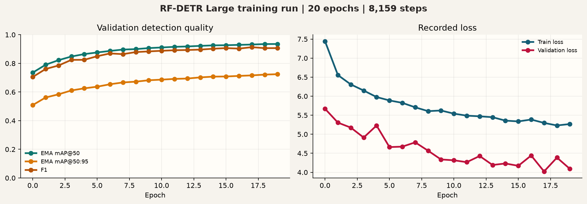
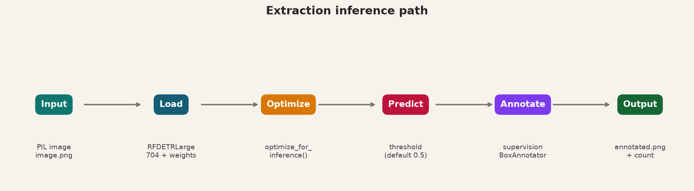
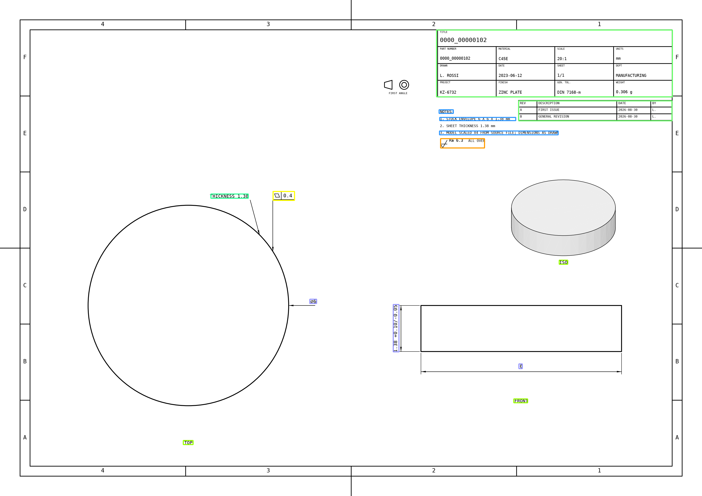

# Extraction — RF-DETR on AutoDraft drawings

The `extraction` package trains and runs an RF-DETR Large object detector on
AutoDraft technical-drawing datasets. It detects annotation marks, including
dimensions, GD&T frames, datums, thread, bore, chamfer, and radius callouts,
tables, notes, leader notes, and view captions.

```text
STEP models -> AutoDraft generation -> COCO dataset
                                      -> extraction.train -> checkpoints/export
                                      -> extraction.infer -> annotated PNG
```

Commands below run from the repository root. Dataset generation, label
semantics, drawing styles, and COCO details are documented in
[generation/README.md](../generation/README.md).



*Figure 1. Training and validation values recorded in `output/metrics.csv`.*

## Contents

1. Training
2. Inference
3. Label classes
4. Dataset layout and current data
5. Recorded training run
6. Artifacts
7. Known limits
8. Related components

## 1. Training

```bash
python -m extraction.train
python -m extraction.train --dataset-dir ./dataset --epochs 20 --batch-size 8 --grad-accum-steps 2
python -m extraction.train --resume output/last.ckpt
```

`train.py` accepts:

| flag | default in current code | meaning |
|---|---|---|
| `--resume` | none | Existing checkpoint to continue from; the path must exist. |
| `--dataset-dir` | `./dataset` | Roboflow-style COCO dataset directory. |
| `--epochs` | `20` | Number of training epochs. |
| `--batch-size` | `8` | Batch size. |
| `--grad-accum-steps` | `2` | Gradient accumulation steps. |

Training constructs `RFDETRLarge(resolution=704, device="cuda")`, calls
`model.train()` with the dataset and options, uses `DOCUMENT_SCAN_AUG`, and
then calls `model.export()`. CUDA is required for training because the device
is hard-coded to `cuda`.

`DOCUMENT_SCAN_AUG` applies a sequence of document-image transformations:
rotation, perspective distortion, one of brightness/contrast, shadow, or
sun-flare, one of several blurs, one of noise/ISO noise/compression, one of
color jitter or grayscale, and downscaling. The configured augmentation
backend in the recorded run is CPU.

## 2. Inference



*Figure 2. The inference sequence implemented in `infer.py`.*

```bash
python -m extraction.infer image.png
python -m extraction.infer image.png \
  -o annotated.png \
  -w output/checkpoint_best_total.pth \
  -t 0.5 \
  --device cuda
```

`infer.py` accepts:

| flag | default | meaning |
|---|---|---|
| `image` | required | Input drawing image. |
| `-o, --output` | `annotated.png` | Annotated image path. |
| `-w, --weights` | `output/checkpoint_best_total.pth` | RF-DETR weights path. |
| `-t, --threshold` | `0.5` | Confidence threshold for retaining detections. |
| `--device` | `cuda` | Inference device. |

The script checks that the image and weights exist, opens the image with PIL,
loads RF-DETR at resolution 704, calls `optimize_for_inference()`, predicts,
and draws the boxes with `supervision.BoxAnnotator`. It saves the annotated
image and prints the number of detected objects.

### Example inference result

The following result was produced by the current script and checkpoint:

```bash
python extraction/infer.py dataset/test/0000_00000102.png \
  -o extraction/assets/inference_result.png \
  -w output/checkpoint_best_total.pth \
  -t 0.5 \
  --device cuda
```



*Figure 3. The checkpoint detected 14 objects on the checked-in test image
`dataset/test/0000_00000102.png` at threshold `0.5`. The output is an
annotated visualization, not an OCR transcription; the colored boxes show
detector predictions and do not assert that every visible annotation was
found.*

## 3. Label classes

The detector uses category 0 as the unused Roboflow root and categories 1–12
as the following classes:

| id | class | mark represented | source in generated drawings |
|---:|---|---|---|
| 1 | `gdnts` | Feature control frames | AP242 PMI, otherwise generated |
| 2 | `roughnesses` | Surface-texture symbols | Generated; the Ra value is not real |
| 3 | `radii` | Fillet and corner-radius callouts | B-rep |
| 4 | `chamferes` | Chamfer and countersink callouts | B-rep; drill points rejected |
| 5 | `bores` | Bore and hole-diameter callouts | B-rep |
| 6 | `threads` | Thread specifications | PMI, otherwise generated against physical tests |
| 7 | `dimensions` | Linear, aligned, angular, and diameter dimensions | B-rep |
| 8 | `notes` | Paragraph block such as `NOTES:` or `UNLESS OTHERWISE SPECIFIED` | Sheet |
| 9 | `datums` | Boxed datum letters and their triangles | PMI, otherwise generated |
| 10 | `leader_notes` | Short leader text such as `THICKNESS 12` | Sheet |
| 11 | `tables` | Ruled blocks of fields | Sheet |
| 12 | `view_captions` | Captions such as `TOP`, `VIEW A`, or `ITEM 3` | Sheet |

For detector labels, `bbox` is `[x, y, w, h]` in pixels with a top-left
origin. It covers annotation text; a table box covers the ruled block. The
detector classifies the mark and does not read its printed value. Generated
COCO annotations also retain the generation-side details described in the
generation README.

## 4. Dataset layout and current data

Expected layout:

```text
dataset/
  train/_annotations.coco.json
  train/<part>.png
  valid/_annotations.coco.json
  valid/<part>.png
  test/_annotations.coco.json
  test/<part>.png
```

Each split is self-contained: the manifest's `file_name` is a bare filename
and the image is beside the manifest. Empty splits may be omitted. AutoDraft's
default fractions are `--val-frac 0.2` and `--test-frac 0.1`; assignment is
hash-distributed, so counts are not required to be exactly 70/20/10.

The current checked-in dataset contains:

| split | images | annotations |
|---|---:|---:|
| train | 6,513 | 158,727 |
| valid | 1,886 | 45,942 |
| test | 979 | 23,658 |
| total | 9,378 | 228,327 |

## 5. Recorded training run

The files in `output/` record a completed 20-epoch run on this dataset. The
following values come from `training_config.json`, `metrics.csv`, the
TensorBoard event file, and the dataset manifests:

| setting | recorded value |
|---|---|
| model and resolution | RF-DETR Large, resolution 704 |
| device | CUDA |
| encoder | `dinov2_windowed_small` |
| queries | 300 |
| optimizer | AdamW |
| learning rates | `lr=0.0001`, `lr_encoder=0.00015` |
| weight decay | `0.0001` |
| batch and accumulation | batch size 8, accumulation 2, effective batch size 16 |
| epochs and steps | epochs 0–19, final logged step 8,159 |
| EMA | enabled; decay `0.993`, tau `100`, update interval 1 |
| scheduler | step scheduler; `lr_drop=100` |
| workers | 2 |
| mixed precision | enabled with automatic AMP dtype |
| multi-scale | enabled; scale jitter enabled |
| gradient clipping | max norm `0.1` |
| early stopping | disabled |
| TensorBoard | enabled; W&B, MLflow, and ClearML disabled |
| logged wall-clock span | approximately 9.54 hours between first and last TensorBoard scalar events |

The final validation row is epoch 19 at step 8,159. The EMA results were:

| validation metric | value |
|---|---:|
| mAP@50 | 0.9352 |
| mAP@50:95 | 0.7245 |
| mAR | 0.7876 |
| F1 | 0.9065 |
| precision | 0.9209 |
| recall | 0.8964 |

Final per-class AP in that validation row was:

| class | AP |
|---|---:|
| `tables` | 0.9686 |
| `roughnesses` | 0.8572 |
| `leader_notes` | 0.8230 |
| `gdnts` | 0.8158 |
| `datums` | 0.7248 |
| `dimensions` | 0.6682 |
| `bores` | 0.6638 |
| `view_captions` | 0.6521 |
| `notes` | 0.6291 |
| `radii` | 0.6206 |
| `chamferes` | 0.4865 |
| `threads` | 0.2865 |

These are validation values for this one run, not a claim about performance on
real drawings or other datasets. The ordinary non-EMA final values are also
recorded in `metrics.csv`: mAP@50 `0.9216`, mAP@50:95 `0.6830`, mAP@75
`0.7761`, mAR `0.7549`, precision `0.9209`, recall `0.8964`, and F1 `0.9065`.

## 6. Artifacts

The extraction package itself is intentionally small:

```text
extraction/
  train.py    RF-DETR Large training and export entry point
  infer.py    RF-DETR Large inference and annotated-image entry point
  assets/     README figures and the measured inference visualization
  README.md   this documentation
```

The current `output/` directory contains:

```text
checkpoint_19.ckpt
checkpoint_9.ckpt
checkpoint_best_ema.pth
checkpoint_best_regular.pth
checkpoint_best_total.pth
last.ckpt
last_ema.pth
rfdetr-large.onnx
hparams.yaml
training_config.json
metrics.csv
events.out.tfevents...
```

`metrics.csv` contains 203 logged rows and per-epoch train/validation values.
The TensorBoard event filename includes a machine- and run-specific suffix.
`hparams.yaml` is present but contains an empty YAML document in the current
artifact set. These files are run outputs; they are not required source files.

Artifacts not included in the repository are available on the shared drive:

<https://drive.google.com/drive/folders/1rHwoiXBxIVY4zxsPVJP3d27EiWnvynUY>

## 7. Known limits

- Transfer to real printed drawings is weak. On real drawings the model may
  miss marks or assign the wrong class even when a lower threshold puts boxes
  in approximately the right places.
- The detector does not read text. A later extraction stage would need to crop
  detections for OCR or a document VLM, or connect detector features to a text
  decoder.
- `threads` has the lowest final per-class AP in the recorded run, consistent
  with the generated-data class imbalance noted by the project documentation.
- Generated surface-finish values are synthetic and must not be treated as
  measured values.

## 8. Related components

- [Generation](../generation/README.md) creates the drawings and COCO labels.
- [Benchmarks](../benchmarks/README.md) evaluates model outputs.
- [Repository overview](../README.md) summarizes the complete workflow.
