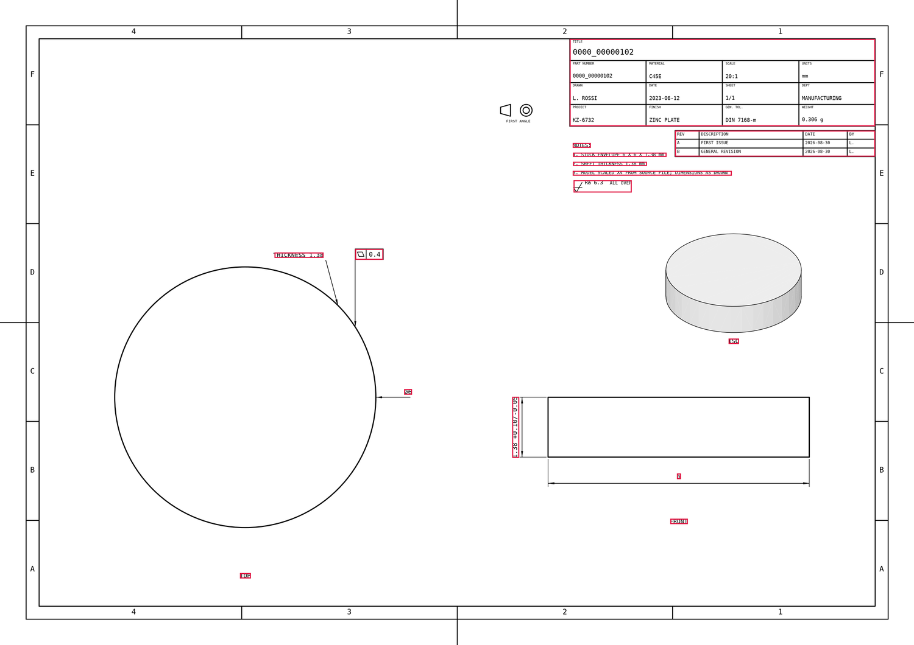

# AutoDraft — drawing datasets from 3D CAD models

Turns **STEP / IGES / BREP** solids into dimensioned 2D drawings, rendered as
**PNG** with **COCO** detection labels. Pure Python on OpenCascade — no CAD
seat, no GUI, no licence.

```
STEP → feature recognition → view selection → OCCT hidden-line
     → auto-dimensioning + callout placement → sheet layout → PNG + labels
```

The PNG is the only rendered output, so the image and the labels cannot
disagree.



*Figure 1. A checked-in test drawing with its generated COCO annotation boxes
outlined in red. The source image is `dataset/test/0000_00000102.png`; the
overlay is produced from the corresponding manifest, not from a model
prediction.*

## Contents

1. Run
2. Output layout
3. House styles
4. Label classes
5. Model scale
6. Sections and detail views
7. Per-drawing variation
8. Sub-part views
9. Conventions
10. CLI
11. Dataset check
12. Layout
13. Known limits
14. Related components

## 1. Run

Installation (including the `requirements.txt` dependencies) is covered in
the repository's main README. All commands below run from the repository
root, as modules:

```bash
python -m generation.cli "generation/examples/models/*.step" -o dataset
```

The Python API is available as `generation.cli`:

```python
from generation.cli.pipeline import make_drawing, batch

r = make_drawing("part.step", "out/part")
r["files"]["png"]              # the labelled image
rec = r["annotation_record"]   # typed record of every mark drawn
rec.annotation_counts          # {'dimension': 14, 'bore': 3, ...}

batch(glob.glob("rfq/*.step"), "dataset")   # errors are per-part, never fatal
```

`make_drawing()` performs one-part generation and returns file paths plus a
typed annotation record. `batch()` expands the input list, processes parts in
parallel when requested, and assembles the split COCO manifests. A part that
fails to render is reported in the per-part result and does not prevent other
parts from being processed.

## 2. Output layout

```
dataset/
  train/_annotations.coco.json
  train/<part>.png
  valid/…
  test/…
  README.dataset.txt
```

The default split is **7 : 2 : 1** train / valid / test
(``--val-frac 0.2 --test-frac 0.1``). Empty splits get no directory, so a
tiny corpus that hashes nothing into ``test/`` simply omits that folder.

The sibling `extraction` package trains an RF-DETR Large detector on this
layout (`python -m extraction.train` / `python -m extraction.infer` from the
repo root). See `extraction/README.md`.

## 3. House styles

Each drawing is rendered in one of ten drawing-office conventions, chosen
deterministically from the part name (`cli/styles.py`). A style is a
*bundle*, not a font swap — border, terminators, number placement,
tolerancing, count-off wording, captions, note block, and whether it sections
and details all move together.

| style | sheet | border | arrowhead | number | tolerancing | notes | captions | other |
|---|---|---|---|---|---|---|---|---|
| `iso_office` | A3 | zoned + centering marks | filled | above the line, aligned | `50 ±0.2` | numbered | TOP / FRONT | first angle, parts list, revision table |
| `asme_inch` | A3 | zoned, 4×2 | filled | **in a gap in the line**, unidirectional | `50 +0.20/-0.10` | UNLESS OTHERWISE SPECIFIED | VIEW A / VIEW B | third angle, 3 decimals |
| `vintage_blueprint` | A2 | double, no zones | **45° ticks** | above the line | limits `50.2/49.8` | numbered | TOP / FRONT | heavy strokes, large text, `4 HOLES` |
| `minimal_cad` | A4 | plain | open vee | horizontal, in a gap | none | none | none | thin strokes, small block |
| `workshop_metric` | A3 | zoned, 6×4 | filled | horizontal | `50 ±0.2` | UNLESS OTHERWISE SPECIFIED | PLAN / ELEVATION / END VIEW | 1 decimal, `4 OFF`, block bottom-left |
| `portrait_din` | **A3 portrait** | zoned, 4×6 + centering marks | filled | above the line | `50 +0.20/-0.10` | numbered | TOP / FRONT | block **top-right**, table top-left, revision table below the block |
| `toolroom_tall` | **A4 portrait** | plain | open vee | in a gap in the line | limits | UNLESS OTHERWISE SPECIFIED | VIEW A / VIEW B | block **top-left**, `4 PLACES`, 3 decimals |
| `aerospace_iso` | A2 | zoned + centering marks | filled | horizontal, unidirectional | `50 +0.20/-0.10` | UNLESS OTHERWISE SPECIFIED | VIEW A / VIEW B | third angle, 3 decimals, flag notes, right-hand table |
| `sheetmetal_shop` | A3 | plain | **45° ticks** | above the line | `50 ±0.2` | numbered | PLAN / ELEVATION / END VIEW | 1 decimal, `4 PLACES`, stock outline, **no sections** |
| `microparts_lab` | **A4 portrait** | double, no zones | open vee | in a gap in the line | limits `50.2/49.8` | UNLESS OTHERWISE SPECIFIED | VIEW A / VIEW B | 3 decimals, block bottom-left |

The title block may sit in any of the four corners, and the sheet may be
portrait or landscape (a tall part is turned onto a tall sheet). The furniture
stack — parts list, notes, finish note, revision table, projection symbol —
follows the block to its corner.

Presentation jitters per drawing (font, stroke, block proportions, table
corner, view spacing), so two ISO sheets differ without either becoming an
ASME sheet. **Geometry and every stated value are untouched** — those are the
labels. `--no-vary` renders the fixed default style.

The styles exercise the conventions a real print has: zoned borders and
centering marks, tolerances beside sizes (symmetric, bilateral, or limits,
capped at a tenth of the nominal and only on a fraction of sizes), aligned
(diagonal) dimensions, four terminator styles, number-below/in-the-line
placement, an UNLESS OTHERWISE SPECIFIED block, a parts list and revision
table, and per-office printed precision (1–3 decimals).

## 4. Label classes

Twelve classes — semantic (what a mark *states*, not how it is drawn).
Category 0 is Roboflow's unused root.

| id | class | what it marks | source |
|----|-------|---------------|--------|
| 1 | `gdnts` | feature control frames | AP242 PMI, else generated |
| 2 | `roughnesses` | surface-texture symbols | **generated — the Ra value is not real** |
| 3 | `radii` | fillet / corner radius and diameter (`⌀`) callouts | B-rep |
| 4 | `chamferes` | chamfer and countersink callouts | B-rep (drill points rejected) |
| 5 | `bores` | non-diametric bore features | B-rep |
| 6 | `threads` | thread specifications | PMI, else generated against physical tests |
| 7 | `dimensions` | linear, aligned, and angular dimensions | B-rep |
| 8 | `notes` | the paragraph block (`NOTES:` / `UNLESS OTHERWISE SPECIFIED`) | sheet |
| 9 | `datums` | boxed datum letters with their triangle | PMI, else generated |
| 10 | `leader_notes` | a short string on a leader (`THICKNESS 12`) | sheet |
| 11 | `tables` | any ruled block of fields; which one in `detail.table_kind` | sheet |
| 12 | `view_captions` | the caption under a view (`TOP`, `VIEW A`, `ITEM 3`) | sheet |

The split follows what a reader recognises as one object: a boxed datum
letter is not a control frame, and a leader label is not a block of prose.
`detail.table_kind` is `title_block` / `parts_list` / `revision` / `hole` /
`hole_summary` — **one box per table**, never one per row.

Every annotation object also carries the detection-schema fields at the top
level, so it validates against the exported `Feature` model regardless of
COCO layout: `id`, `bbox` (`[x, y, w, h]` whole pixels, y-down), `text`,
`category` (the singular label value, e.g. `gdnt` — `gdt` on the record is
written as `gdnt`), and `confidence` (always `1.0` for ground truth). The
COCO-only fields (`image_id`, `category_id`, `area`, `iscrowd`,
`segmentation`, `attributes`) are kept alongside, and `Feature` tolerates
them as extras.

Generated specifications set `attributes.detail.synthetic = true`; a file
carrying real PMI is never overridden. An empty class in a split is correct
labelling, not an error.

`bbox` is `[x, y, w, h]` in pixels, origin top-left, covering the annotation
**text only** (a table's box is the ruled block); the dimension or leader's
full extent is in `attributes.extent_bbox`.

## 5. Model scale

A sub-millimetre model would state its features at a precision it cannot
carry (a 0.035 mm feature as "0.04"). Such a model is scaled by a **round
factor** (2 … 5000) so its smallest stated feature lands between 1 and 3 mm.
The factor varies per part and is recorded on the drawing record; every source
of a printed number (envelope, each body, bores, fillet radii) is counted when
picking it, so no dimension on the sheet is below a millimetre.

## 6. Sections and detail views

A part with internal features is **sectioned** (`cli/section.py`): the solid is
cut, the remainder projected, and the cut faces hatched at 45° with an even-odd
scanline — so a bore through the cut face leaves a hole in the hatching. The
parent view carries the cutting-plane line with arrows and letters, and the
section is captioned `SECTION A-A`. `Style(section_views=False)` turns it off.

A feature too small to letter in place, or a crowded region, gets a **detail
view** (`cli/detail.py`): the region is ringed on the parent and redrawn magnified
in free paper as `DETAIL A (2:1)`, with the true magnification stated. The
dimensions that belong to those features are drawn in the detail view rather
than on the parent, which is why the view exists at all. Several details per
sheet are normal.

## 7. Per-drawing variation

Beyond the house style, these vary per drawing (`variation.vary_style`):

| Convention | Variants |
| --- | --- |
| Count-off wording | `4X` / `4 HOLES` / `4 PLACES` / `4 OFF` / `R6 TYP` |
| Reference dimension | `(34)` / `34 REF` / not marked |
| Pitch circle | `ON ⌀100 B.C.` / `ON ⌀100 PCD` / `⌀100 P.C.D.` / `EQUALLY SPACED…` |
| Chamfer | `2 X 45°` / `C2` / `2 X 45° CHAM` |
| General tolerance block | ISO 2768 class / ASME table |
| Flag notes | numbered triangle pointing at where a general note applies |
| Revision marks | lettered or numbered triangle beside changed dimensions |
| Stock outline | ISO 128 type K phantom line, `STOCK 35 X 35` |
| Sections | one (A-A) or two (A-A and B-B), each with its own cutting plane |

Nothing here states anything about the model that is not measured from it: a
reference dimension is only marked when a chain really sums to it, EQ SP only
when the angles are uniform, and the chamfer short form only for 45°.

## 8. Sub-part views

A file holding several solids is a drawing of several parts. Each body gets
its **own annotated orthographic view** in a reserved strip — `ITEM 1`,
`ITEM 2` … each a real projection with its own dimensions and callouts.
`examples/models/handle_assembly.step` exercises it; disable with
`Style(subpart_views=False)`.

## 9. Conventions

- **Millimetres always**, at the office's precision, independent of scale.
- **Nothing is invented silently** — generated content is flagged.
- **Paper vs. model space** is stated on every geometric field; map between
  them with `ViewRecord.paper_origin`.
- **Deterministic** — style, split and every generated value come from a
  SHA-1 hash of the part name, so a corpus regenerates identically.

## 10. CLI

From the repository root:

```bash
python -m generation.cli "generation/examples/models/*.step" -o dataset
```

`python -m generation` is equivalent — the package's `__main__.py` calls
the same CLI.

| flag | default | meaning |
|---|---|---|
| `inputs` | (required) | Model files or globs (STEP / IGES / BREP) |
| `-o, --out` | `dataset/` | Output directory |
| `--sheet` | `A3` | Sheet size (`A4`…`A0`, `A`…`D`, portrait via `A3P` etc.) |
| `--dpi` | `200` | PNG resolution |
| `--val-frac` | `0.2` | Validation fraction (hash of part name) |
| `--test-frac` | `0.1` | Test fraction; with `--val-frac` this is 7:2:1 |
| `--no-vary` | off | Fixed house style; values and geometry never vary |
| `--hole-table` / `--no-hole-table` | auto | Force the hole table on or off |
| `-j, --jobs` | auto | Worker processes (`1` serial, `0` one per core) |
| `--progress` / `--no-progress` | on | Progress bar on stderr |

## 11. Dataset check

```bash
python -m generation.tools.coco_view dataset/train           # boxes back onto the images
python -m generation.tools.coco_view dataset/train --check   # validate, no images
```

## 12. Layout

```
generation/
  __main__.py     entry point; runs the cli module
  assets/          README figures and generated drawing preview
  cli/
    __init__.py
    __main__.py
    cli.py           command line
    annotate.py      dimensions, chains, aligned dims, callout solver
    coco.py          per-drawing COCO labels (12 classes)
    dataset.py       train/valid/test COCO dataset assembly
    detail.py        small features + their dims           (DETAIL A 2:1)
    export.py        PNG renderer (the one output format)
    gdt_symbols.py   characteristic symbols as vector geometry
    geometry.py      loading, scale normalisation, feature recognition
    pipeline.py      make_drawing(), batch()
    pmi.py           AP242 PMI reader: GD&T frames, datums, threads
    projection.py    HLR projection, view selection
    render.py        view placement, primitives, sheet furniture
    roughness.py     surface-finish assignment (all synthetic)
    schema.py        typed AnnotationRecord models (pydantic)
    schema_adapter.py    pipeline dicts -> validated record
    section.py       cut the solid, hatch the cut faces    (SECTION A-A)
    shading.py       tessellate + cull + depth-sort facets for the isometric
    sheet.py         style, sheet sizes and scales, frame, title block, tables
    styles.py        the ten house styles, tolerance and count-off vocabulary
    synth_pmi.py     geometry-tied synthetic PMI for the scarce classes
    textmetrics.py   true rendered ink extent, for tight detection boxes
    titleblock.py    title-block field set and content (GENERATED)
    variation.py     per-drawing jitter inside a house style
  examples/  make_parts.py + models/ (26 STEP files; one with real AP242 PMI,
             one five-item assembly for sub-part views)
  tests/     test_autodraft.py (regression tests); sheetdoc.py reads a rendered sheet
  tools/     coco_view.py   dataset preview / validator
```

The repository also contains `generation/examples/models/` with the example
STEP inputs listed in the attached project tree. Generated dataset files use
this layout:

```text
dataset/
  train/
    _annotations.coco.json
    <part>.png
  valid/
    _annotations.coco.json
    <part>.png
  test/
    _annotations.coco.json
    <part>.png
```

Large generated datasets or other artifacts that are not included in the
repository are available on the shared drive:

<https://drive.google.com/drive/folders/1rHwoiXBxIVY4zxsPVJP3d27EiWnvynUY>

```bash
python generation/examples/make_parts.py && python -m pytest generation/tests -q
```

## 13. Known limits

- **Radius leaders are not radial** — 15 of 16 radius notes, median 53.6° off
  the arc's radius line.
- **Tight dimensions keep their arrows inside** — 9 of 68 cases where the text
  does not fit between the witness lines.
- **Densest sheet** (NIST, 57 annotations): 3 leader-leader crossings, 2
  text-on-line hits. Annotation text boxes never overlap on any sample part.
- Not done: **ordinate dimensioning**, **tolerance stacks**, **assemblies with
  balloons**, **weldment symbols**. (Sections and detail views *are* done.)
- **Surface-finish values are synthetic.** Do not train a drawing→Ra regression
  on them.

Always have an engineer check a drawing before it becomes a contract document.

## 14. Related components

- [Extraction](../extraction/README.md) trains an RF-DETR detector on the
  generated COCO dataset.
- [Benchmarks](../benchmarks/README.md) evaluates model outputs against the
  dataset ground truth.
- [Repository overview](../README.md) summarizes the complete workflow.
